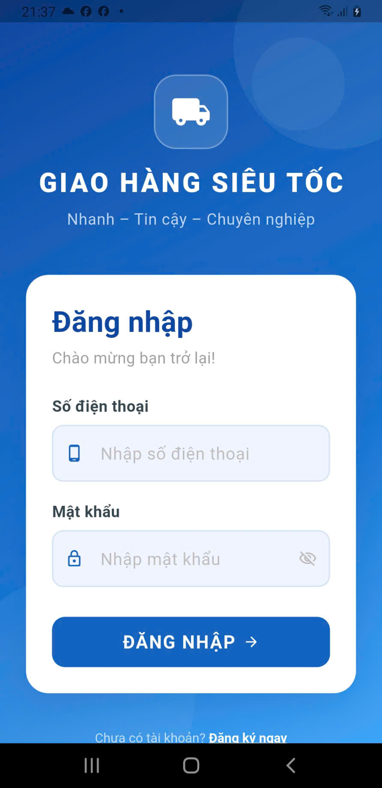
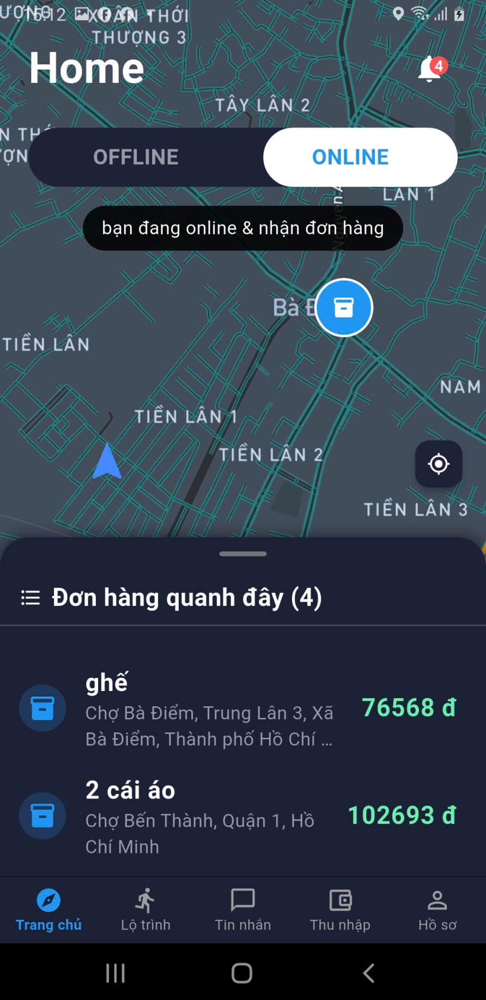
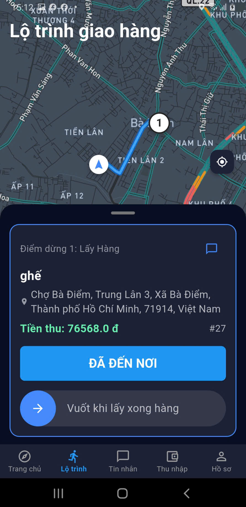
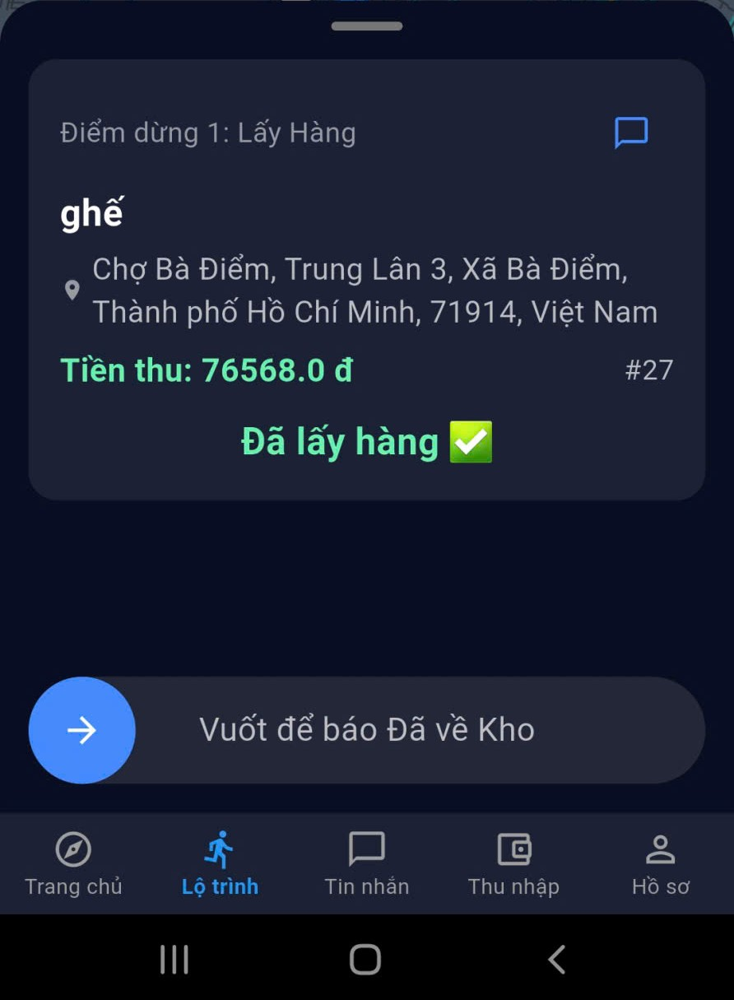

# 🚀 SmartShip - Hệ thống Giao nhận Thông minh

## 📖 Giới thiệu
SmartShip là nền tảng di động đa nền tảng kết nối "Người Gửi hàng" với "Người Giao hàng", giúp quy trình vận chuyển trở nên minh bạch và hiệu quả. Hệ thống được xây dựng trên kiến trúc Microservices có khả năng mở rộng cao, tích hợp công nghệ theo dõi thời gian thực, tối ưu lộ trình và trợ lý ảo AI để nâng cao trải nghiệm người dùng.

## 📸 Giao diện Hệ thống (Screenshots)

### 📦 Luồng Người Gửi (Sender Flow)
*Trải nghiệm đặt đơn nhanh chóng, trực quan và theo dõi trạng thái giao hàng theo thời gian thực.*

| Đăng nhập hệ thống | Chọn địa chỉ vận chuyển | Chi tiết gói hàng | Theo dõi đơn hàng |
|:---:|:---:|:---:|:---:|
|  |  |  |  |
| *Giao diện xác thực* | *Ghim vị trí chính xác* | *Mô tả & Hình ảnh* | *Quản lý chuyến đi* |

### 🛵 Luồng Người Giao Hàng (Driver Flow)
*Tối ưu hóa hành trình, hỗ trợ định vị chính xác và tương tác linh hoạt với khách hàng.*

| Trực tuyến nhận đơn | Định vị & Lộ trình | Tương tác khách hàng | Cập nhật trạng thái |
|:---:|:---:|:---:|:---:|
|  |  |  |  |
| *Quét đơn hàng lân cận* | *Bản đồ lộ trình tối ưu* | *Báo cáo vị trí điểm đến* | *Xác nhận lấy hàng* |

### 🤖 Trợ lý Ảo Thông Minh (SmartShip AI)


*Trợ lý AI hỗ trợ giải đáp tự động về giá cước, lộ trình và các vấn đề vận chuyển.*

## 🛠️ Công nghệ & Kiến trúc (Tech Stack)
- **Backend Architecture:** Phát triển bằng Spring Boot theo kiến trúc Microservices có tính mở rộng cao, định tuyến tập trung qua API Gateway.
- **Cơ sở dữ liệu (Database Strategy):**
  - **PostgreSQL:** Lưu trữ dữ liệu giao dịch có cấu trúc (thông tin người dùng, đơn hàng).
  - **MongoDB:** Lưu trữ và truy vấn chuỗi thời gian cho dữ liệu vị trí GPS.
  - **Redis:** Xử lý truyền tải dữ liệu thời gian thực cho tính năng theo dõi tài xế.
- **Frontend / Client:**
  - **Mobile App:** Flutter (Cross-platform) dành cho cả Người Gửi và Người Giao hàng.
  - **Admin Web:** ReactJS.
- **Tích hợp bên thứ ba (Integrations):**
  - Mapbox / Google Maps API (Tối ưu lộ trình).
  - VNPay API (Cổng thanh toán trực tuyến).
  - RESTful API & Groq API.

## ✨ Tính năng nổi bật (Key Features)
- **Quy trình vận hành liền mạch:** Xử lý toàn bộ vòng đời đơn hàng từ lúc đặt, tính toán chi phí, cho đến khi hoàn thành.
- **Tracking Real-time:** Ứng dụng Redis để phát tín hiệu vị trí, giúp Người Gửi xem tài xế di chuyển trực tiếp trên bản đồ.
- **Tối ưu lộ trình & Điều phối:** Gợi ý chuyến đi ngắn nhất cho tài xế dựa trên Mapbox/Google Maps.
- **SmartShip AI (RAG):** Chatbot hỗ trợ khách hàng được trợ lực bởi AI, ứng dụng kiến trúc Retrieval-Augmented Generation (RAG) qua Groq API, cung cấp câu trả lời chính xác, nhận thức ngữ cảnh.
- **Thanh toán bảo mật:** Tích hợp cổng VNPay cho các giao dịch không tiền mặt.

## ⚙️ Hướng dẫn Cài đặt (Installation & Setup)

Để triển khai hệ thống cục bộ, bạn cần cài đặt: **Java (JDK 17+)**, **Node.js**, **Flutter SDK**, cùng các hệ quản trị cơ sở dữ liệu (PostgreSQL, MongoDB, Redis).

### 1. Cài đặt Backend (Spring Boot Microservices)
```bash
# Di chuyển vào thư mục backend
cd SmartShip_backend

# Cấu hình môi trường: 
# Cập nhật thông tin kết nối DB (Postgres, Mongo, Redis), VNPay Keys và Groq API Key trong file application.yml / application.properties.

# Build và chạy ứng dụng
./mvnw clean install
./mvnw spring-boot:run
